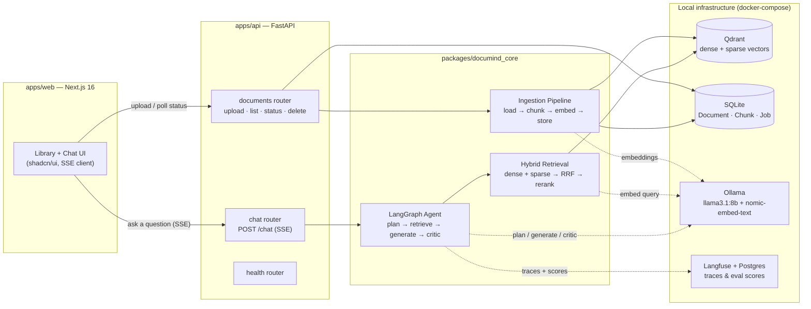
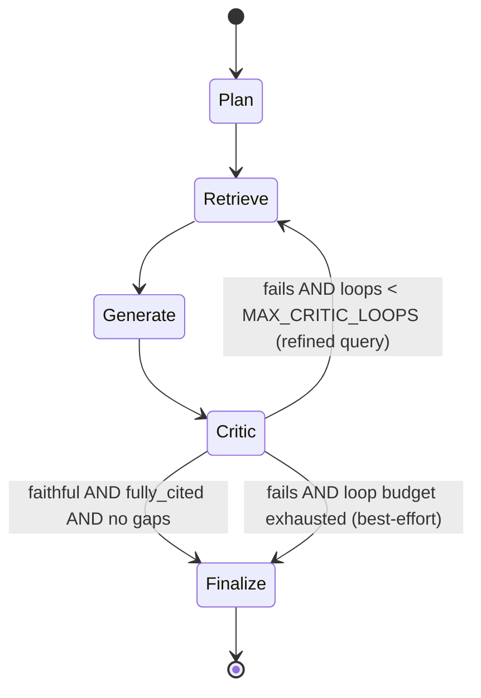

# DocuMind

**Ask your documents anything — and get answers that cite exactly where they came from.**

DocuMind is a local-first RAG (Retrieval-Augmented Generation) application. Upload PDFs, DOCX, HTML, or Markdown files, and ask questions in natural language. Every answer is generated by a self-critiquing LangGraph agent, grounded in hybrid (dense + sparse) retrieval over your own documents, and cited inline with `[n]` markers you can click to see the exact source passage. Runs entirely on your machine — Ollama for inference, Qdrant for vectors, SQLite for metadata, no API keys, no cloud bill.

<!-- <p align="center">
  
  <br/>
  <em>[Screenshot placeholder — Library view showing document cards with ingest status]</em>
</p>

<p align="center">
  
  <br/>
  <em>[GIF placeholder — asking a question and watching the agent timeline + streamed, cited answer]</em>
</p> -->

---

## Features

- **Drag-and-drop ingestion** — PDF, DOCX, TXT/Markdown, and HTML, chunked with a token-aware splitter (~512 tokens, ~15% overlap) that never splits a section that fits.
- **Hybrid retrieval** — dense (embedding) + sparse (BM25-style) search fused with Reciprocal Rank Fusion, then re-ranked with a cross-encoder (`BAAI/bge-reranker-base`) for precision at low top-k.
- **Self-critiquing agent** — a LangGraph state machine plans, retrieves, generates, and critiques its own answer for faithfulness and citation coverage, looping back to retrieve again (with a refined query) if it falls short — up to a configurable retry budget.
- **Real inline citations** — every claim in the answer is cited `[n]`; clicking a citation opens a drawer showing the source document, page, and section it came from. No hallucinated sources: if the context doesn't support an answer, the agent says so.
- **Live streaming UI** — Server-Sent Events stream the agent's progress (plan → retrieve → generate → critic) as a visible timeline, plus the answer token-by-token, all the way to a Next.js frontend built on shadcn/ui.
- **Full observability** — every chat turn, LLM call, and embedding batch is traced in Langfuse (self-hosted, free), with token counts and latency. Runs in a clean no-op mode if you don't configure it.
- **Built-in evaluation harness** — retrieval quality (hit@k, MRR, nDCG) and generation quality (RAGAS-style faithfulness, answer relevance, context precision) measured with your local LLM as judge, scores pushed straight to Langfuse.
- **100% local by default** — no OpenAI key, no Pinecone, no hosted vector DB. Ollama + Qdrant + SQLite + Postgres, all via one `docker-compose.yml`.

---

## Architecture



---

## Tech stack

| Layer | Choice | Why |
|---|---|---|
| **LLM inference** | [Ollama](https://ollama.com) running `llama3.1:8b` | Fully local, zero API cost, good enough instruction-following for plan/generate/critic at 8B with a critic loop to catch mistakes. Swappable via `OLLAMA_LLM_MODEL`. |
| **Embeddings** | Ollama `nomic-embed-text` (768-dim) | Local, fast on CPU, strong retrieval quality for its size — no reason to pay for a hosted embedding API for a local-first app. |
| **Vector store** | [Qdrant](https://qdrant.tech) | Native support for **named vectors** (dense + sparse in one collection) and server-side IDF weighting on sparse vectors — lets one collection serve both halves of hybrid search without bolting on a second index. |
| **Reranker** | Cross-encoder `BAAI/bge-reranker-base` (via FlagEmbedding / sentence-transformers) | Hybrid search is fast but coarse; a cross-encoder scores (query, chunk) pairs jointly for a real precision jump at the small top-k (~8) that actually reaches the prompt. |
| **Relational store** | SQLite via SQLModel | Zero-ops for a local-first, single-user app — Document/Chunk/Job metadata doesn't need a client-server DB here. Swap `SQLITE_URL` for Postgres if you outgrow it. |
| **Agent orchestration** | [LangGraph](https://langchain-ai.github.io/langgraph/) | The plan→retrieve→generate→critic loop is a genuine state machine with conditional retries, not a linear chain — LangGraph's explicit graph + conditional edges model that directly, including the critic-triggered loop-back. |
| **Backend** | FastAPI | Native `async`/`BackgroundTasks` for keeping CPU-bound ingestion off the event loop, first-class `StreamingResponse` for SSE, and Pydantic schemas shared cleanly with the frontend's TypeScript types. |
| **Frontend** | Next.js 16 (App Router) + shadcn/ui + Tailwind v4 | Server/client component split fits the app shell vs. interactive-chat split naturally; shadcn/ui components are copied into the repo (not an opaque dependency), so the whole UI stays fully customizable. |
| **Streaming transport** | Server-Sent Events (hand-rolled, not `EventSource`) | `EventSource` can't POST a JSON body, so the client reads the raw `ReadableStream` and parses SSE itself — simpler than WebSockets for a one-shot request → many-events response shape. |
| **Observability** | [Langfuse](https://langfuse.com) (self-hosted) | Free, self-hosted, OpenTelemetry-based tracing that captures a full trace per chat turn (nested spans per agent node, generations for every LLM/embedding call) with zero code changes when disabled — a clean no-op fallback if you don't configure keys. |
| **Evaluation** | Custom harness, Ollama-as-judge | No hosted-LLM judge required — faithfulness, answer relevance (via RAGAS's actual hypothetical-question-embedding method), and context precision are all scored by the same local model you're already running. |

---

## Quickstart

### Prerequisites

- **Python 3.12** (3.11+ supported)
- **Node 22**
- **Docker** (for Qdrant + Postgres + Langfuse)
- **[Ollama](https://ollama.com/download)** installed and runnable (`ollama serve`)

### 1. Clone and configure

```bash
git clone https://github.com/your-org/documind.git
cd documind
cp .env.example .env
```

The defaults in `.env.example` work out of the box for local development — you only need to edit it if you're pointing at non-default ports or want Langfuse tracing enabled (see [Configuration reference](#configuration-reference)).

### 2. Pull the local models

```bash
chmod +x scripts/pull_models.sh
./scripts/pull_models.sh
```

This pulls `llama3.1:8b` (generation) and `nomic-embed-text` (embeddings) via Ollama. Takes a while the first time — together they're a few GB.

### 3. Start local infrastructure

```bash
make up
```

Brings up Qdrant (`:6333`), Postgres, and Langfuse (`:3000`) via `docker-compose.yml`.

### 4. Install and run the API

```bash
pip install -e packages/documind_core
pip install -e apps/api
cd apps/api && uvicorn app.main:app --reload --port 8000
```

The API creates its SQLite tables and Qdrant collection automatically on startup (see `lifespan` in `apps/api/app/main.py`). Check `http://localhost:8000/health`.

### 5. Install and run the web app

```bash
cd apps/web
npm install
cp .env.local.example .env.local   # NEXT_PUBLIC_API_URL=http://localhost:8000
npm run dev
```

Open `http://localhost:3000`.

### 6. Seed some sample documents (optional but recommended)

```bash
python scripts/seed_docs.py
```

Ingests a small sample corpus (`evaluation/datasets/corpus/`) so you have something to ask about — and something for the evaluation harness to measure. Or just drag your own files into the Library page.

### One-liner (after steps 1–3)

```bash
make dev   # runs the API and web app together, see Makefile
```

---

## RAG deep-dive

**Ingestion** (`documind_core.ingestion.pipeline.ingest_document`):

```
load (PDF/DOCX/HTML/Markdown → text sections)
  → chunk (~512 tokens, ~15% overlap, never splits a section that fits)
    → embed (dense: Ollama nomic-embed-text · sparse: local BM25-style term-frequency vectorizer)
      → store (Qdrant: dense + sparse named vectors, payload = doc_id/chunk_id/page/section/text)
        → record (SQLite: Document + Chunk + Job rows, for status polling and listing)
```

Every stage is idempotent: chunk IDs are deterministic (`f"{doc_id}:{ordinal}"`, where `doc_id` is a hash of the resolved file path), so re-ingesting the same file deletes old chunks and replaces them — safe to run `seed_docs.py` (or re-upload) repeatedly without duplicating vectors.

**Retrieval** (`documind_core.retrieval`):

1. **Dense search** — embed the query, cosine search Qdrant's dense vectors.
2. **Sparse search** — vectorize the query into the same term-hash space used at ingestion, search Qdrant's sparse index (Qdrant applies IDF weighting server-side).
3. **Fusion** — combine both ranked lists with [Reciprocal Rank Fusion](https://plg.uwaterloo.ca/~gvcormac/cormacksigir09-rrf.pdf) (`k=60`), so a chunk that scores well on *both* signals outranks one that only wins on one.
4. **Rerank** — the fused top candidates are re-scored by a cross-encoder (`BAAI/bge-reranker-base`) that looks at the query and chunk *together*, then truncated to `RERANK_TOP_N` (default 8) — small enough to fit comfortably in the generation prompt.

**Generation** — the top reranked chunks are numbered `[1]..[n]` and inserted into the prompt; the model is instructed to cite every claim and to say "insufficient context" rather than invent an answer when the sources don't cover the question.

---

## LangGraph agent design

The agent (`documind_core.agent`) is a small, explicit state machine — not a single prompt, and not an unstructured tool-calling loop:



| Node | What it does |
|---|---|
| **Plan** | Decomposes the question into 1–4 focused sub-queries (structured JSON output). |
| **Retrieve** | Runs hybrid search + rerank for each sub-query (or a refined query on a retry loop), deduplicating against chunks already collected. |
| **Generate** | Writes a cited answer using *only* the numbered retrieved chunks. |
| **Critic** | A structured-output judge (`{faithful, fully_cited, gaps[]}`) audits the draft. On failure with retry budget remaining, it feeds its `gaps` back into a query-refinement prompt before looping to Retrieve. |
| **Finalize** | Terminal no-op node — exists so streamed events have an unambiguous "done" signal. |

Every node emits an SSE event (`node_start`, `tool_result`) that the frontend renders as a live timeline chip, plus `token` events for the streamed answer and a final `citation` + `final` event. The critic's JSON output uses the same "extract JSON, retry on malformed output, default to pass rather than crash" pattern as the evaluation harness's LLM judges — small local models occasionally wrap JSON in prose or code fences, and the whole pipeline is built to degrade gracefully rather than hard-fail on that.

---

## Observability

Every chat turn is wrapped in a Langfuse trace (`documind_core.observability.langfuse_client.observe_turn`), with nested spans for each agent node and a `generation` record for every LLM call and embedding batch — including token counts and latency. Wiring is transparent to the rest of the codebase: `observe_node`, `observe_llm_call`, and `observe_embedding` are just context managers that no-op cleanly if `LANGFUSE_PUBLIC_KEY` / `LANGFUSE_SECRET_KEY` aren't set, so nothing breaks if you skip Langfuse entirely.

To enable it:

```bash
# .env
LANGFUSE_HOST=http://localhost:3000
LANGFUSE_PUBLIC_KEY=pk-lf-...
LANGFUSE_SECRET_KEY=sk-lf-...
```

(Generate a keypair from the Langfuse UI at `http://localhost:3000` after `make up`.) Once configured, every chat turn — and every evaluation run — shows up as a trace with per-node timing and, for eval runs, faithfulness/relevance/precision scores attached directly to the trace.

---

## Evaluation

Two complementary harnesses live in `evaluation/`:

**Retrieval quality** — `python -m evaluation.retrieval_eval`
Measures **hit@k**, **MRR**, and **nDCG@k** for the hybrid retriever against `evaluation/datasets/qa_pairs.jsonl`. Ground truth is resolved dynamically against the live database (matching each question's named source document + a short exact phrase) rather than hardcoded chunk IDs — chunk IDs are derived from an absolute file path and aren't portable across machines, so hardcoding them would silently break for anyone else who clones the repo. See `evaluation/datasets/README.md` for the full rationale.

```
Retrieval Metrics (n=10 questions)
===================================
Metric    k=1    k=3    k=5    k=10
-----------------------------------
Hit Rate  70.0%  90.0%  100.0% 100.0%
nDCG      0.700  0.812  0.847  0.847

MRR: 0.783
```
*(illustrative — run it yourself after seeding to get real numbers)*

**Generation quality** — `python -m evaluation.run_eval`
RAGAS-style **faithfulness** (are the answer's claims actually supported by retrieved context?), **answer relevance** (via RAGAS's real method — generate hypothetical questions the answer would suit, embed them, compare to the actual question), and **context precision** (rank-weighted: are the retrieved chunks actually relevant, and are the relevant ones ranked early?) — all judged by your local Ollama model, no hosted judge required. Every question's scores are pushed to Langfuse as a trace.

```bash
python -m evaluation.run_eval --limit 3     # quick smoke test
python -m evaluation.run_eval               # full run
python -m evaluation.run_eval --no-langfuse # skip score pushing
```

Or via the Makefile: `make eval`.

---

## Project structure

```
documind/
├── apps/
│   ├── api/                         FastAPI backend
│   │   ├── app/
│   │   │   ├── main.py              App factory, lifespan (DB + Qdrant setup), CORS
│   │   │   ├── deps.py              DI singletons (embedder, vector store)
│   │   │   ├── sse.py               SSE response helpers (headers, event formatting)
│   │   │   ├── schemas.py           Pydantic request/response models
│   │   │   └── routers/
│   │   │       ├── documents.py     upload · list · status · delete
│   │   │       ├── chat.py          POST /chat — streams agent events as SSE
│   │   │       └── health.py        Ollama + Qdrant health check
│   │   └── pyproject.toml
│   │
│   └── web/                         Next.js 16 frontend
│       ├── app/
│       │   ├── layout.tsx           App shell: sidebar nav, dark mode, fonts
│       │   ├── library/page.tsx     Upload + document grid
│       │   └── chat/page.tsx        Message thread + streaming input
│       ├── components/
│       │   ├── ui/                  shadcn/ui primitives (button, card, sheet, ...)
│       │   ├── layout/              Sidebar, mobile nav, theme toggle, status dot
│       │   ├── upload/              Dropzone, ingest stepper, progress cards
│       │   ├── documents/           Document card, grid, delete-confirm dialog
│       │   ├── chat/                Message thread, agent timeline, chat input
│       │   └── citations/           Inline [n] links, citation drawer (Sheet)
│       └── lib/                     api.ts · sse.ts · types.ts · file-type.ts
│
├── packages/
│   └── documind_core/                Shared Python library (installed editable)
│       └── documind_core/
│           ├── config.py             pydantic-settings, reads .env
│           ├── models.py             SQLModel: Document, Chunk, Job, Message
│           ├── paths.py              Repo-relative path resolution
│           ├── loaders/              PDF / DOCX / HTML / Markdown → text sections
│           ├── chunking/             Token-aware chunker + tokenizer fallback
│           ├── embeddings/           OllamaEmbedder (batching, retry, health check)
│           ├── vectorstore/          QdrantStore (dense + sparse named vectors)
│           ├── ingestion/            ingest_document() pipeline + sparse vectorizer
│           ├── retrieval/            RRF fusion, hybrid search, cross-encoder rerank
│           ├── agent/                LangGraph: state, nodes, prompts, graph
│           └── observability/        Langfuse client + no-op fallback
│
├── evaluation/
│   ├── datasets/
│   │   ├── qa_pairs.jsonl            10 QA pairs over the sample corpus
│   │   ├── corpus/                   4 sample markdown documents
│   │   └── README.md                 Ground-truth resolution design notes
│   ├── metrics.py                    hit@k, MRR, nDCG (pure functions)
│   ├── ragas_metrics.py              Faithfulness / relevance / precision math
│   ├── llm_judge.py                  Ollama-as-judge LLM + embedding calls
│   ├── retrieval_eval.py             python -m evaluation.retrieval_eval
│   ├── run_eval.py                   python -m evaluation.run_eval
│   └── reporting.py                  Shared summary table printer
│
├── scripts/
│   ├── pull_models.sh                 ollama pull llama3.1:8b + nomic-embed-text
│   └── seed_docs.py                   Ingest the evaluation sample corpus
│
├── docker-compose.yml                 Qdrant + Postgres + Langfuse
├── Makefile                           up / down / logs / dev / seed / eval
├── .env.example
├── .gitignore
└── README.md
```

---

## Configuration reference

All configuration is read from `.env` at the repo root (`documind_core.config.Settings`, backed by `pydantic-settings`).

| Variable | Default | Description |
|---|---|---|
| `OLLAMA_BASE_URL` | `http://localhost:11434` | Base URL of your running Ollama instance. |
| `OLLAMA_LLM_MODEL` | `llama3.1:8b` | Model used for plan / generate / critic. |
| `OLLAMA_EMBED_MODEL` | `nomic-embed-text` | Embedding model (768-dim). |
| `QDRANT_URL` | `http://localhost:6333` | Qdrant REST endpoint. |
| `QDRANT_COLLECTION` | `documind` | Collection name (dense + sparse named vectors). |
| `RERANKER_MODEL` | `BAAI/bge-reranker-base` | Cross-encoder model for reranking (HuggingFace). |
| `SQLITE_URL` | `sqlite:///./data/documind.db` | SQLAlchemy connection string for metadata storage. |
| `LANGFUSE_HOST` | `http://localhost:3000` | Your self-hosted Langfuse URL. |
| `LANGFUSE_PUBLIC_KEY` | *(empty)* | Leave empty to disable tracing (clean no-op fallback). |
| `LANGFUSE_SECRET_KEY` | *(empty)* | Leave empty to disable tracing. |
| `MAX_CRITIC_LOOPS` | `2` | Max retrieve→generate→critic retries before finalizing anyway. |
| `RETRIEVE_TOP_K` | `40` | Candidates pulled from each of dense/sparse search before fusion. |
| `RERANK_TOP_N` | `8` | Chunks kept after cross-encoder reranking (what the LLM actually sees). |

Frontend-only: `apps/web/.env.local` needs `NEXT_PUBLIC_API_URL` (default `http://localhost:8000`).

---

## Deployment notes

DocuMind is **local-first by design** — this matters for how you think about running it beyond your laptop:

- **Single-user, single-machine assumptions.** SQLite and the in-process embedder/reranker singletons are built for one user on one machine, not concurrent multi-tenant traffic. If you need multiple users, plan to swap SQLite for Postgres (`SQLITE_URL` is a standard SQLAlchemy URL, so this is a config change, not a rewrite) and put a real process manager in front of the API.
- **Ollama needs real compute.** `llama3.1:8b` wants a decent amount of RAM (8GB+ free, more is better) and is meaningfully faster with a GPU. On CPU-only free-tier cloud instances, expect generation to be slow — this stack was designed to be *free of API costs*, not necessarily fast on minimal hardware.
- **The cross-encoder reranker downloads on first use** (~280MB for `bge-reranker-base`), lazily, the first time `rerank()` is called — make sure your deployment target has internet access for that one-time download, or pre-bake it into your image.
- **Langfuse + Postgres are for local observability, not production-grade hosting.** The `docker-compose.yml` Postgres has no backup/replication story — fine for a personal instance, not for anything you'd be sad to lose. Consider Langfuse Cloud's free tier if you want tracing without self-hosting the database.
- **No auth is built in.** The FastAPI app has no login/session layer — if you expose it beyond `localhost`, put it behind your own auth (a reverse proxy with basic auth, or a real auth layer) first.
- **CORS is locked to localhost dev origins** in `apps/api/app/main.py` — update `allow_origins` before deploying the frontend anywhere else.

None of this is a criticism of the free tier — it's the intended trade: you get a fully capable RAG stack with zero recurring API costs, in exchange for owning the ops of your own inference and vector store.

---

## Roadmap

- [ ] Chunk-text preview in the citation drawer (currently shows doc/page/section/score, not the passage itself — the SSE stream deliberately caps `retrieve` events at 5 sources without full text to keep events small; a `GET /chunks/{chunk_id}` endpoint would unlock this).
- [ ] Real token-level LLM streaming (currently the backend generates the full answer, then re-emits it word-by-word to simulate streaming — genuine token streaming needs `generate_node` to consume `ChatOllama`'s async stream directly).
- [ ] Multi-user auth + Postgres-backed metadata for shared deployments.
- [ ] Additional loaders (PPTX, CSV/XLSX, plain email formats).
- [ ] CI job that runs the evaluation harness on every PR and fails on regression against a committed baseline.
- [ ] Horizontal scaling story for Qdrant (sharding/replication) once collections outgrow a single node.
- [ ] Conversation memory across turns (today each chat turn is independent — no multi-turn context yet).

---

## License

MIT — see [LICENSE](LICENSE).
